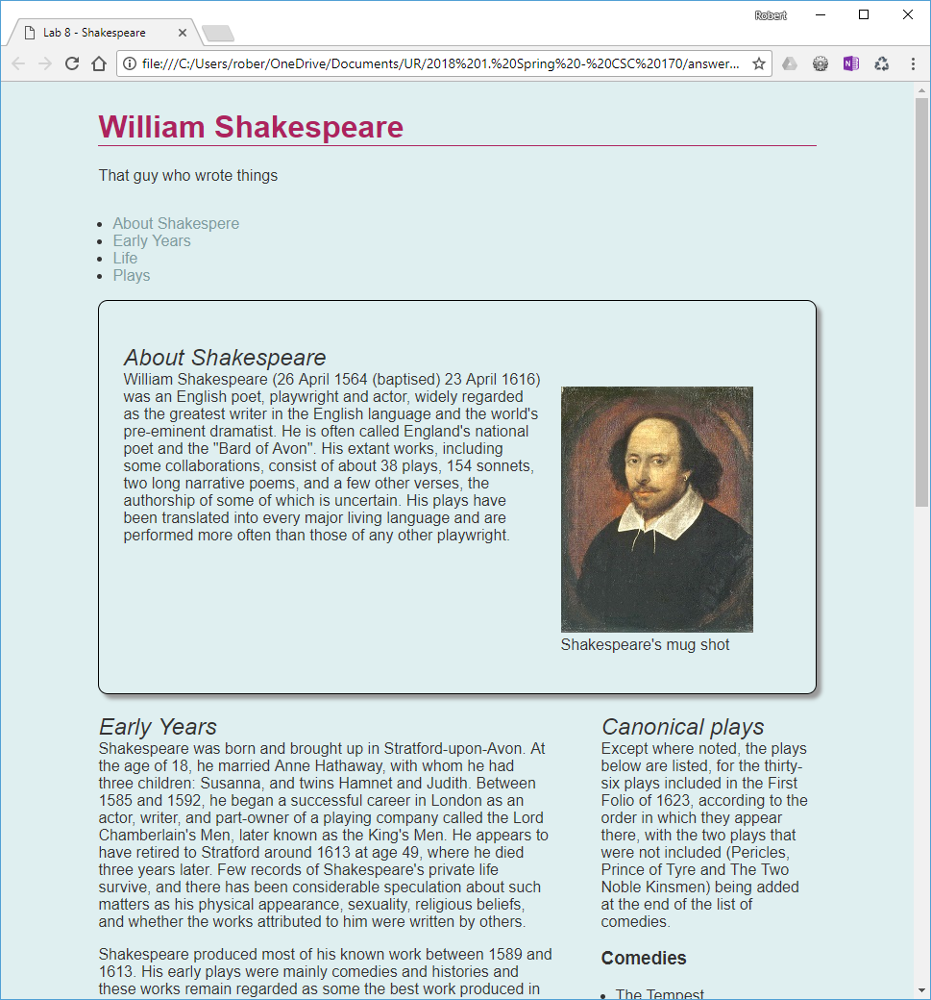
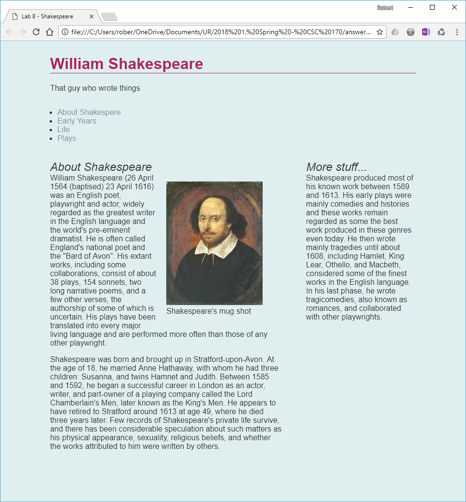
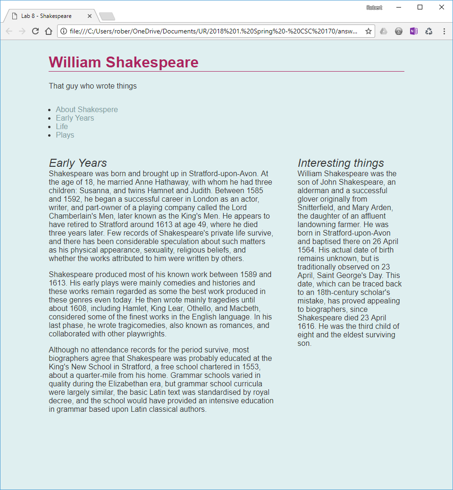
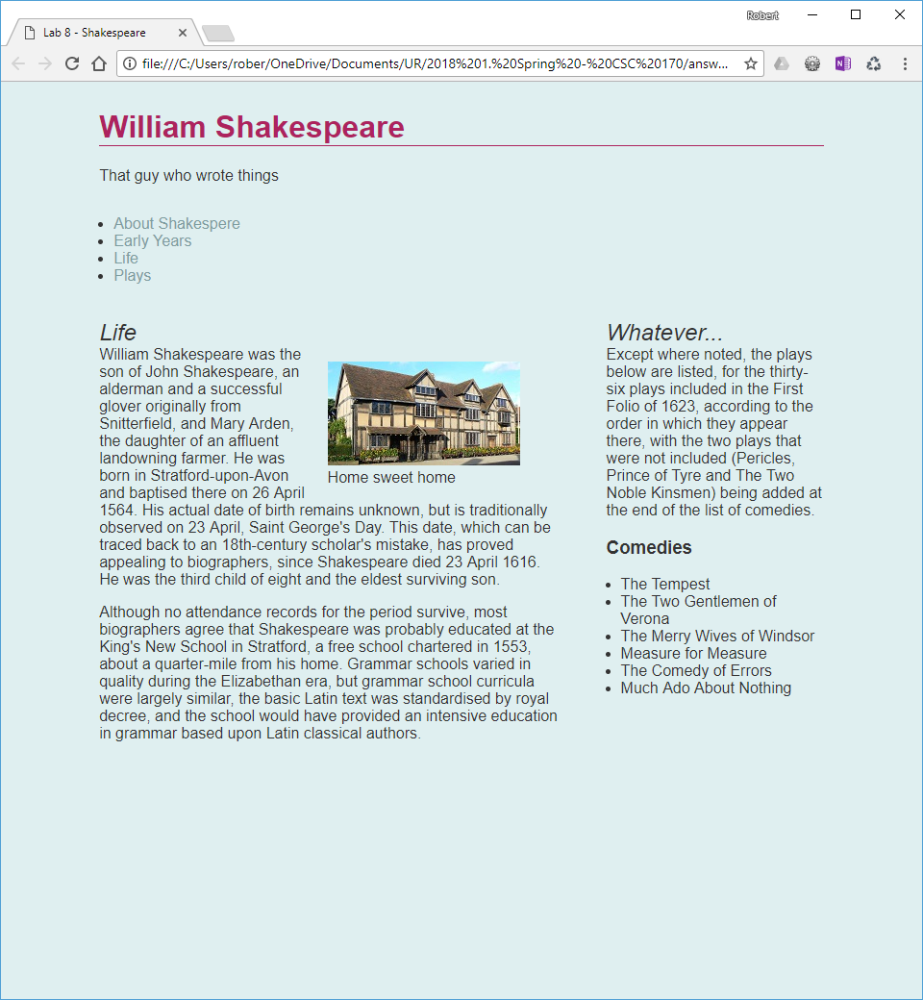
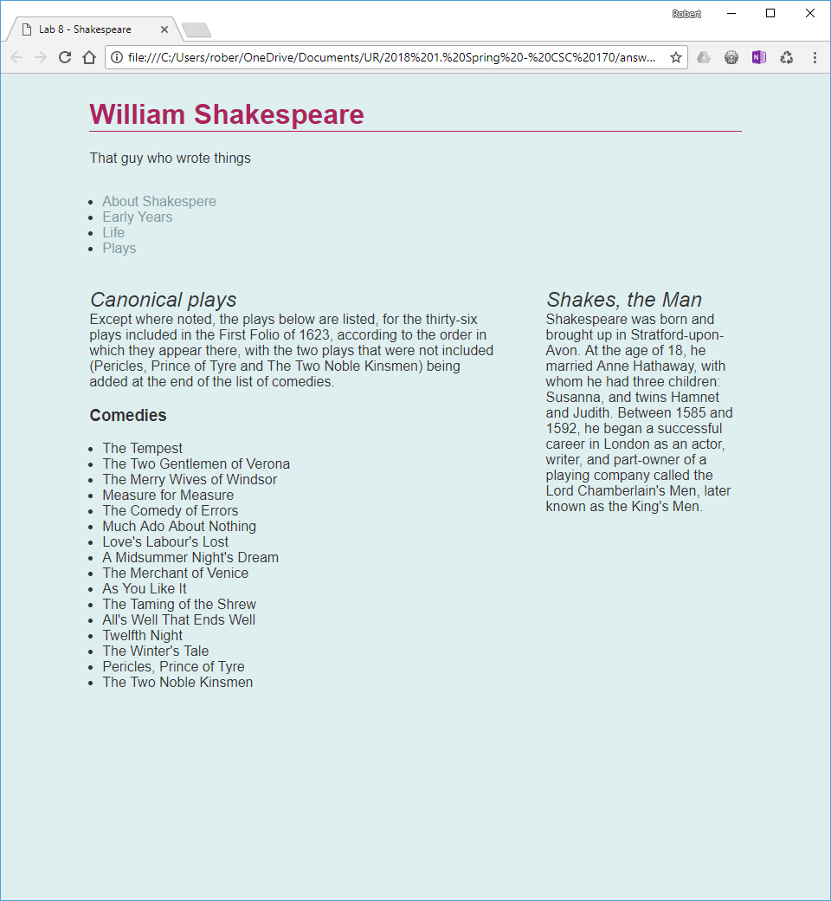
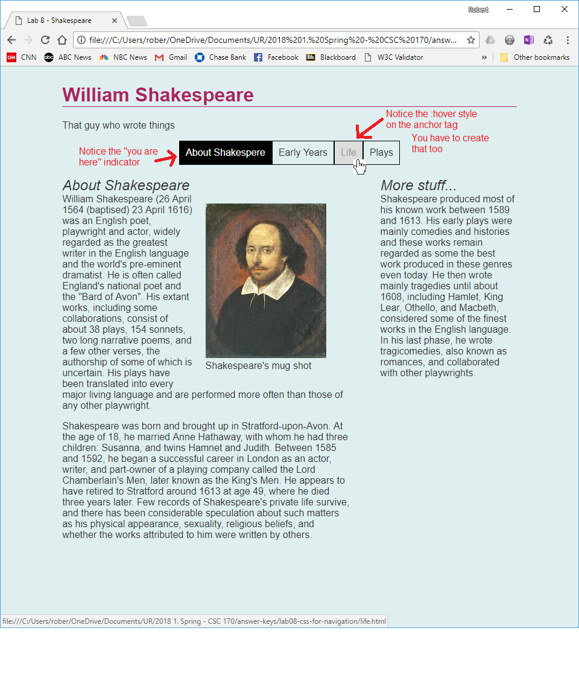

## Lab 8: CSS for Navigation
*Due: Wednesday, October 14, 2020 - extra time!*

This lab has three parts to it:

- Part 1: Add a plain HTML navigation element (NAV) your webpage
- Part 2: Chop your webpage into multiple webpages
- Part 3: Style the navigation element in CSS

*Note: Part 2 of this assignment is labor intensive and may take a lot of time.  Be careful; try to get it done perfectly or else this lab and every lab that comes after will be messed-up.* 

## Part 1: Add a plain HTML navigation element (NAV) your webpage

### Make a copy of Lab 7 (CSS for Layout)

- [ ] Make a copy of all the files from Lab 7 and put them in a new folder named **lab08**

- [ ] In your **start.html** file, change the title in the TITLE tag to "Lab 8 - …" 

### Create a second CSS file

- [ ] In the HEAD of the HTML file, under the existing LINK to your **styles.css** file, create a new link tag to attach *another* CSS file that you’ll name: **navigation.css**
- [ ] In the file system, in the **css** folder, create a new blank plain-text file named **navigation.css**

### Code a navigation element in HTML

- [ ] In your **start.html** file, insert a new NAV element between the existing HEADER and SECTION like this:

```html
<header>
	<h1>William Shakespeare</h1>
	<p>That guy who wrote things</p>
</header>

<nav>
</nav>

<section class="lead">
  <h2>About Shakespeare</h2>

```

- [ ] Add a class to the NAV element; the class name should reflect what you plan to do with it (Hint: keep it simple; call the class `"menu"`)

- [ ] Within the NAV element, build a menu *list* using the semantically correct HTML as demonstrated in the lecture.
  - In each list item, create an anchor tag. For the HREF of each anchor tag, you can simply use the `"#"` placeholder for now. 
  - For the text in each anchor tag use the same words as your **H2**s in the document.  (There should be at least four.)  For example, (using the professor’s Shakespeare demo) you would have something like this:
    - *About Shakespeare*
    - *Early Years*
    - *Life*
    - *Plays*

  *Note: if your H2s have a lot of words in them, you can shorten them to one or two words*
      
- [ ] **Edit the HREF attributes in each anchor tag** <br>Change the "#" in each anchor tag to an appropriate file name  (you’ll create the files later); base the file names on the four **H2**s in your ARTICLE and ASIDE.  

  - For example, (using the professor’s Shakespeare demo) your HREFs would contain something like this 

    ```html
    href="about-shakespeare.html"
    href="early-years.html"
    href="life.html"
    href="plays.html"
    ```

*Remember the naming rules for all files and folders on the web: all names must be all lowercase and no spaces.*

**Note: there is *not* supposed to be a link to a homepage nor the start.html file. We'll fix that in another lab assignment, later. For now, you will have a website *without* a homepage.**

### Fix the CSS Grid

At this point, your webpage layout has gone to smash.  You'll see that the new NAV element is screwing-up the CSS Grid from Lab 7.  You need to fix it.

- [ ] Edit your **styles.css** (not the navigation.css file) and find the *grouped* selector you created from Lab 7. Looks like this...

  ```css
  header, footer, .lead {
  	grid-column: 1 / 3;
  }
  ```

- [ ] Add the new **NAV** element as another *grouped* selector to that style, i.e., add a comma after `.lead` and type `nav` so the new NAV element will also span the grid from line #1 to line #3.  (After this edit, the NAV element should fall into place.  You can close the *styles.css* file - you won't need to edit it anymore.)

## Part 2: Chop your webpage into multiple webpages

In this part, you must take your **start.html** file and, in effect turn it into four smaller webpages. 

*NOTE: this part of this assignment is not really real-worldy.  This is just what we must do so we can have a meaningful set of files to complete this lab assignment.*

At this point, your **start.html** webpage should look something like this except with your content and your styles - but the layout should be identical.



- Close all files in your editor and go back to your computer’s file system

- Make four copies of your **start.html** file.  Set the file names of the copies appropriately, based on the four HREF attributes you wrote in your NAV element in Part 1.  For example, (using the professor’s Shakespeare demo) you would name the copies of your start.html file something like this: 

  - about-shakespeare.html
  - early-years.html
  - life.html
  - plays.html

  Remember the naming rules for all files and folders on the web: all names must be all lowercase and no spaces.

*NOTE: from here on out, do not edit the **start.html** file anymore.  Although it won't be part of your Lab 8 website (it won't be in the navigation system), it can just ride-along with the other files.  We'll need the start file in a later lab.*

- [ ] Edit each of the four HTML files one at a time.  (Leave the **start.html** file as-is.)  Move content around the four files as needed.  The goal is to end up with the four pages having only content that's related to the file name.

- See the four **examples** further below.  To end-up with pages that are like those examples: in each of the four HTML files you will need to:

  - In one of the files, move the content out of the .lead section (back to the H2 from whence it came) 
  - Then delete the .lead element completely in all four webpages
  - Delete the FOOTER completely in all four webpages
  - Move content around between the ARTICLE and ASIDE - this is *really* not a normal thing to do!  Normally you would never do this - just try to balance the content visually, side-by-side
  - Create new H2s as necessary - just make-up stuff.  This is just an exercise so even if you have to steal content from one section to another, go ahead and do it.
  - You may end up not using all the content from your original webpage - that's okay

### Examples

Take a look at these examples.  This is your goal.

My *about-shakespeare.html* page

- Notice the "Lead" is gone - I moved the content from the Lead back into the Article and deleted everything else
- I moved one of the paragraphs from the "About Shakespeare" section over to the ASIDE and made-up a new H2 for it




My *early-years.html* page...

- Here again, deleted everything else, and shuffled some content over to the ASIDE and created a new H2




My *Life.html* page...

- Here I stole some content from my original ASIDE and left it in the ASIDE just to balance things out a bit.  It doesn't make much sense from a content standpoint, but that's okay for this exercise.




My *plays.html* page...

- This last page is just a complete mess of content ...but it works



At this point, you should try your un-styled navigation system.  It should work. 

*Remember: the **start.html** file should **not** be part of the navigation system!  For now, it's just a dead file in your file system. We'll fix that in another lab assignment, later.*  

## Part 3: Style the navigation element in CSS

The particulars on how to code the following comes right out of the second lecture on navigation.  Refer to the *CSS Recipe for Navigation*.

### Basic Styles for a Horizontal Menu Bar

- Edit your **navigation.css** file (not the styles.css file) by targeting the menu element using *descendant selectors*; add the typical code web developers use to nullify the default styles of an unordered list 

- If it makes sense for your website styles, add a border to the menu items so they look more buttony<br>*NOTE: you don't necessarily have to add a border - or you can remove it later; the key thing is to style your menu in a way that makes sense for the design you created in Lab 6.  What exactly you do is up to you*

- Use **CSS flex** to get the list items to line-up horizontally
  - Note: technically, when styling a horizontal menu system, you can use any of the typical layout tools to get the list items to line-up horizontally: **inline-block**, **CSS table-cell**, or **CSS flex** (recommended).  But for this exercise, you should use **CSS flex**.

- To create a bigger area for the user to click
  - Turn the anchor tags in the menu from **inline** (its default) to **block**
  - And add some **padding** to the anchor tags

### Customize

- Differentiate the anchor tags in the menu from the other anchor tags in this document:
  - Style the anchor tags in the menu with a different, contrasting **color**
  - Get rid of the "**text decoration**" (unless you really want to keep it)
  - Make the **hover effect** for the anchor tags in the menu another color that contrasts well with the other hovered text color; perhaps add a background color on the hover as well
  - Continue making more embellishments to various parts of the navigation elements; in CSC 170 more is better, but whatever you do make sure the menu is still readable and usable

## Add the "you are here" indicator

As you navigate from page-to-page, the navigation system needs to tell the user what page they're on by differentiating the style of the menu item that refers to the current page.  

- [ ] Back in the HTML of all *four* webpages edit the NAV element.  (Leave the **start.html** file alone.)  

- [ ] For each page, on the appropriate anchor tag in the list, add a class (e.g. `class="is-current"`) that indicates that that link represents the current page in the website.

- [ ] Edit the **navigation.css** file.  Add a style that targets the "is-current" class (or whatever you called it) so it differentiates the style of the current menu item wherever it's used. 
  - In your CSS… `.menu a.is-current { }` 
  - Write a style for .is-current that makes sense for your design.

When complete, you should have something like this, but styled in a way that goes with your design!



## Upload and report your work

- When you are done with your web site, close everything and use an FTP tool to access your account on csc170.org and upload your files:
  - In a web browser (any), go to this address to check your handiwork:<br>`www.csc170.org/accountname/lab08`<br>(where “accountname” is your account name)
  - NOTE: there is *no* homepage for your website (yet) - just four HTML files plus your dead **start.html** file.  In Blackboard, you don't have to link to any of the HTML files.  Just provide a link to the **lab08**  folder - the TAs will figure it out from there.

- Remember: Use the W3C HTML validator (`validator.w3.org`) on every page! AND the W3C CSS validator (`jigsaw.w3.org/css-validator`) to check your work before you report it!
- In our CSC 170 Blackboard section, in Lab 8, post a link to your webpage to receive credit for this Lab.

